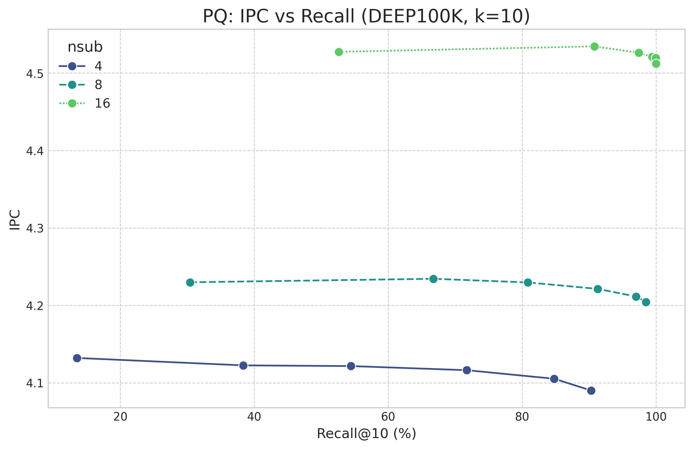

# PQ 算法 Perf 性能分析报告

数据集: DEEP100K, k=0.13545
测试时间: 2025-04-23 21:37:20.111905

## 核心性能指标概览

|   nsub |   rerank_k |   recall_percent |      qps |   ipc |   l1_miss_rate | llc_miss_rate   |   branch_miss_rate |
|-------:|-----------:|-----------------:|---------:|------:|---------------:|:----------------|-------------------:|
|      4 |         10 |           13.545 | 2882.908 | 4.132 |          0.062 | N/A             |              0.239 |
|      4 |         50 |           38.375 | 2647.877 | 4.122 |          0.063 | N/A             |              0.246 |
|      4 |        100 |           54.425 | 2461.163 | 4.122 |          0.064 | N/A             |              0.252 |
|      4 |        200 |           71.750 | 2154.281 | 4.116 |          0.066 | N/A             |              0.256 |
|      4 |        400 |           84.785 | 1685.550 | 4.105 |          0.067 | N/A             |              0.269 |
|      4 |        600 |           90.290 | 1438.917 | 4.090 |          0.069 | N/A             |              0.286 |
|      8 |         10 |           30.435 | 1727.202 | 4.230 |          0.062 | N/A             |              0.343 |
|      8 |         50 |           66.755 | 1648.424 | 4.234 |          0.062 | N/A             |              0.339 |
|      8 |        100 |           80.870 | 1557.332 | 4.230 |          0.062 | N/A             |              0.343 |
|      8 |        200 |           91.285 | 1440.399 | 4.221 |          0.064 | N/A             |              0.346 |
|      8 |        400 |           96.995 | 1252.591 | 4.211 |          0.066 | N/A             |              0.359 |
|      8 |        600 |           98.490 | 1113.596 | 4.204 |          0.069 | N/A             |              0.365 |
|     16 |         10 |           52.640 |  955.190 | 4.527 |          0.052 | N/A             |              0.336 |
|     16 |         50 |           90.805 |  941.616 | 4.534 |          0.054 | N/A             |              0.329 |
|     16 |        100 |           97.420 |  903.145 | 4.526 |          0.054 | N/A             |              0.335 |
|     16 |        200 |           99.420 |  873.742 | 4.521 |          0.054 | N/A             |              0.341 |
|     16 |        400 |           99.940 |  795.630 | 4.519 |          0.056 | N/A             |              0.343 |
|     16 |        600 |           99.995 |  733.914 | 4.512 |          0.058 | N/A             |              0.345 |

## 性能分析

### 1. Recall vs. QPS (主要权衡)

- **趋势**: 对所有 `nsub` 值，随着 `rerank_k` 增加（通常对应曲线上从左上到右下的点），召回率提高，但 QPS 下降。
- **`nsub` 影响**: 较高的 `nsub` (如 32) 通常能达到更高的召回率上限，但其 QPS 普遍低于较低的 `nsub` (如 8 或 16)。
- **`rerank_k` 影响**: 增加 `rerank_k` 对召回率的提升存在边际效益递减，但对 QPS 的负面影响（延迟增加）持续存在。
- **分析**: `rerank_k` 控制精确计算的范围，直接影响延迟。`nsub` 影响量化精度和 ADC 阶段的计算量。选择最佳配置需要在两者间权衡。

### 2. IPC (Instructions Per Cycle)

- **趋势**: IPC 随 `rerank_k` 增加（召回率提高）而变化的趋势可能不单一。
  - ADC 阶段（`rerank_k` 较小）可能因查表和整数运算有较高 IPC。
  - Rerank 阶段（`rerank_k` 较大）涉及浮点 SIMD 计算 (`compute_l2_sq_neon`)，其 IPC 可能不同，且受内存访问影响。
- **`nsub` 影响**: 不同 `nsub` 的 IPC 可能相似或有细微差别，取决于 ADC 和 Rerank 各阶段的相对耗时。
- **分析**: IPC 反映 CPU 执行效率。较低的 IPC 可能意味着更多的 CPU 停顿（例如等待内存）。PQ 算法混合了查表、整数和浮点 SIMD，IPC 是综合表现。

### 4. 分支预测未命中率

- **趋势**: 分支预测错误率通常与代码中条件分支（if/else, 循环）的预测难度有关。PQ 的核心循环（ADC, Rerank）结构相对固定，Branch Miss Rate 可能变化不大，或随 `rerank_k` 增加略有变化（Rerank 循环次数增加）。
- **分析**: 较低的分支预测错误率有助于维持流水线效率。如果此比率异常高，可能指示代码中存在难以预测的分支，可以考虑优化（如循环展开、分支避免）。

## 结论与建议

- PQ 算法通过调整 `nsub` 和 `rerank_k` 提供了灵活的性能-精度权衡。
- 增加 `rerank_k` 能显著提高召回率，但会增加延迟（降低 QPS），需关注边际效益。
- 增加 `nsub` 可能提高召回率上限，但会增加 ADC 阶段的计算开销。
- 缓存性能（尤其是 Rerank 阶段对原始数据的访问）和 CPU 执行效率（IPC）是影响最终性能的关键因素。
- 建议根据具体应用场景选择合适的 `nsub` 和 `rerank_k` 组合。例如，对于召回率要求极高的场景，选择 `nsub=16/32` 和较高的 `rerank_k`；对于延迟更敏感的场景，选择 `nsub=8/16` 和适中的 `rerank_k`。
